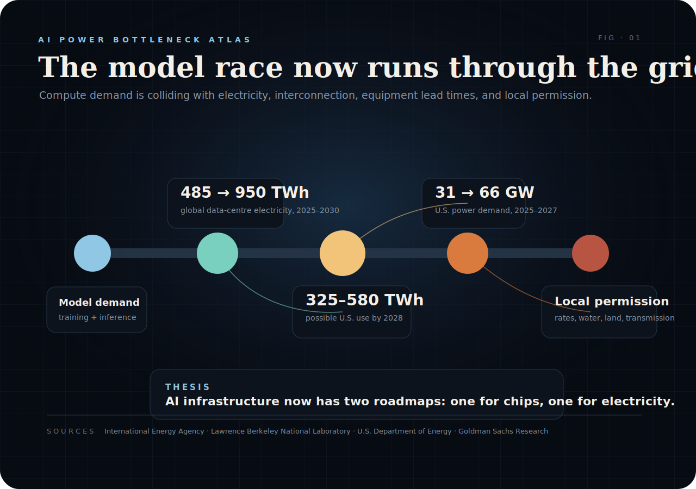
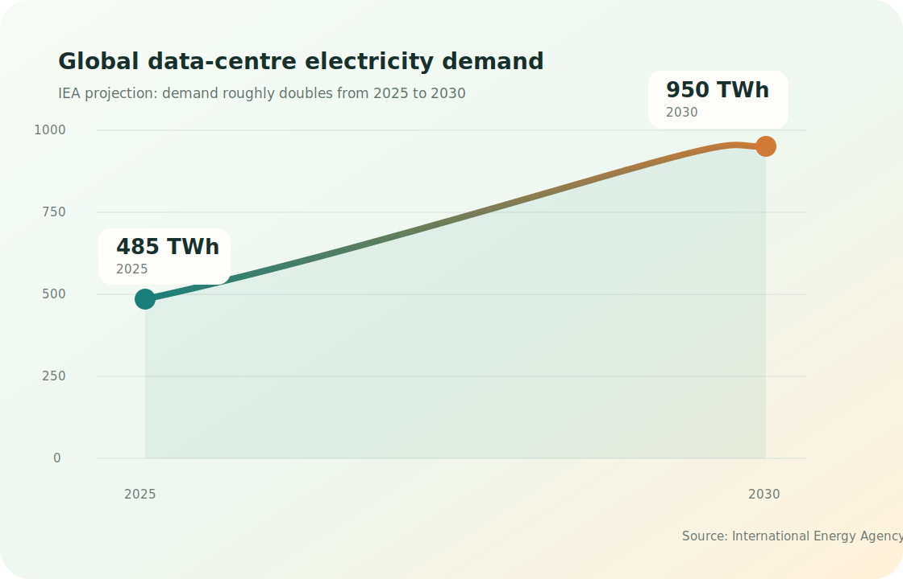
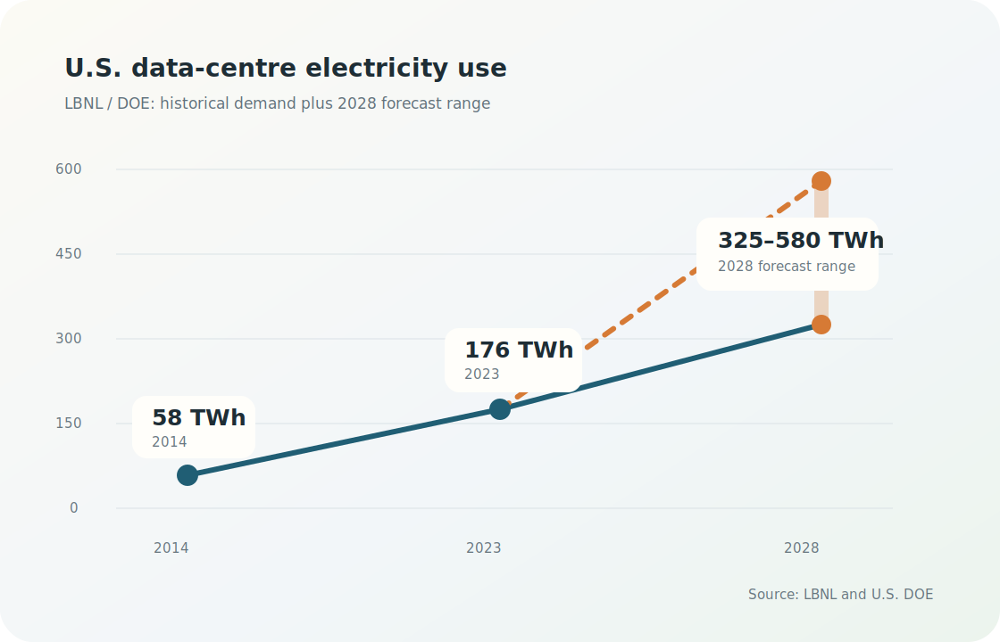
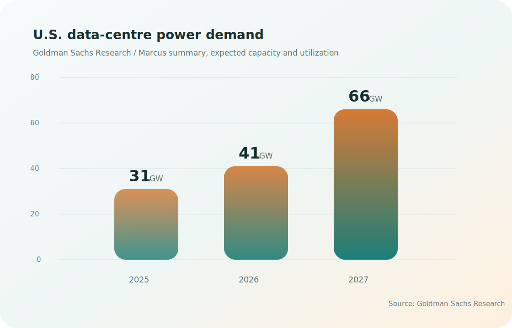

# The AI Boom Is Becoming A Power Grid Story

My view: the next AI bottleneck will be negotiated in power markets before it shows up in model benchmarks.

The companies that win the next phase of AI infrastructure will pair compute strategy with energy strategy. GPU supply still matters. Model quality still matters. But the harder constraint is moving from a data-centre announcement to an energized site with enough power, cooling, transmission, permits, and local consent.

Every model demo hides a physical question underneath it: where does the electricity come from, how fast can the grid deliver it, who pays for the upgrade, and what happens when compute demand lands faster than transmission can be built?

The question has moved from theoretical to financial. The International Energy Agency projects global data-centre electricity consumption to rise from roughly **485 TWh in 2025** to around **950 TWh in 2030**. In the IEA’s framing, data centres would account for about **3% of global electricity demand** by 2030, with AI-focused facilities growing even faster.

In the United States, the curve is sharper. Lawrence Berkeley National Laboratory and the U.S. Department of Energy estimate U.S. data-centre electricity use rose from **58 TWh in 2014** to **176 TWh in 2023**, and could reach **325–580 TWh by 2028**. That would move data centres from about **4.4% of U.S. electricity use in 2023** to roughly **6.7–12% by 2028**.

The AI race now has a second scoreboard: interconnection queues, transformers, cooling, land, gas turbines, PPAs, substations, and political permission.

## 1. The demand curve has changed shape

For a decade, data-centre energy demand looked manageable because efficiency gains absorbed much of the digital growth.

AI changed the slope.

The IEA’s global projection is simple enough to remember: data-centre electricity demand roughly doubles by 2030. AI-focused data centres grow faster still. The important point is the break in planning rhythm.

Slow demand can be absorbed through normal utility planning.

Clustered demand forces utilities, regulators, and developers to make decisions under uncertainty.

## 2. The U.S. is the stress test

The U.S. has the deepest hyperscaler buildout, the largest concentration of AI infrastructure, and some of the most visible grid bottlenecks.

The LBNL/DOE report puts the 2023 U.S. data-centre load at **176 TWh**. Its 2028 range, **325–580 TWh**, is wide for a reason: future electricity use depends on AI server growth, utilization, efficiency, and how quickly new capacity actually connects.

The wide forecast range is the signal. Planning has to happen before the industry knows which path demand will take.

## 3. Power demand is becoming an investment theme

Goldman Sachs Research frames the next bottleneck as a power-demand problem. Its research projects global data-centre power demand to rise by roughly **175% by 2030 versus 2023**.

Another Goldman Sachs note cited U.S. data-centre power demand rising from **31 GW in 2025** to **41 GW in 2026** and **66 GW in 2027**, based on expected capacity growth and utilization assumptions.

That changes the map of AI winners. The obvious beneficiaries are chipmakers and cloud platforms. The less obvious winners sit in the electrical stack: grid equipment, power developers, cooling systems, transmission, backup generation, and sites that can actually get energized.

## 4. Local politics will become part of AI strategy

Electricity demand is abstract until it appears on a bill, in a water debate, or at a county hearing.

A data centre may serve global AI demand, but the substation, water supply, land use, and transmission line sit in a specific place.

That creates a new kind of execution risk for AI companies. They can sign power-purchase agreements and buy clean-energy certificates, yet local communities will still ask practical questions: will this project raise rates, consume scarce water, or delay power for homes and factories?

The next phase of AI infrastructure will be judged by benchmark scores and by the physical system around them.

## 5. Coordination is the real bottleneck

The AI industry is good at scaling software.

The power grid scales through planning, capital, permitting, equipment lead times, and local politics.

Permitting takes time. Transmission takes time. Transformers take time. Gas turbines and substations take time. Data-centre developers can announce capacity faster than utilities can deliver it.

That mismatch is becoming the hidden architecture of the AI boom.

The winners will be the companies that secure power early, manage siting, reduce water stress, improve utilization, and treat energy as part of product strategy.

AI is still a model race.

Increasingly, the model sits inside a power contract.

## Source Table

| Claim | Source | Date / Range | Figure |
|---|---|---:|---:|
| Global data-centre electricity demand roughly doubles by 2030 | International Energy Agency, *Key Questions on Energy and AI* | 2025–2030 | 485 TWh to 950 TWh |
| Data centres reach around 3% of global electricity demand by 2030 | International Energy Agency | 2030 | ~3% |
| U.S. data-centre electricity use in 2014 | Lawrence Berkeley National Laboratory / DOE | 2014 | 58 TWh |
| U.S. data-centre electricity use in 2023 | Lawrence Berkeley National Laboratory / DOE | 2023 | 176 TWh |
| U.S. data-centre electricity use forecast range | Lawrence Berkeley National Laboratory / DOE | 2028 | 325–580 TWh |
| U.S. data-centre share of electricity | Lawrence Berkeley National Laboratory / DOE | 2023 / 2028 | 4.4% to 6.7–12% |
| Global data-centre power demand growth | Goldman Sachs Research | 2030 vs. 2023 | +175% |
| U.S. data-centre power demand | Goldman Sachs Research / Marcus summary | 2025–2027 | 31 GW, 41 GW, 66 GW |

## Sources

- International Energy Agency, “Executive summary – Key Questions on Energy and AI”: https://www.iea.org/reports/key-questions-on-energy-and-ai/executive-summary
- International Energy Agency, “Energy demand from AI”: https://www.iea.org/reports/energy-and-ai/energy-demand-from-ai
- Lawrence Berkeley National Laboratory, “Berkeley Lab Report Evaluates Increase in Electricity Demand from Data Centers”: https://bies.lbl.gov/news/berkeley-lab-report-evaluates-increase-electricity-demand-data-centers
- U.S. Department of Energy, “DOE Releases New Report Evaluating Increase in Electricity Demand from Data Centers”: https://www.energy.gov/articles/doe-releases-new-report-evaluating-increase-electricity-demand-data-centers
- Goldman Sachs Research, “Data Center Power Demand: The 6 Ps Driving Growth and Constraints”: https://www.goldmansachs.com/insights/goldman-sachs-research/data-center-power-demand-the-6-ps-driving-growth-and-constraints
- Marcus by Goldman Sachs, “What Is the Forecast for US Data Center Power Demand?”: https://www.marcus.com/us/en/resources/heard-at-gs/what-is-the-forecast-for-us-data-center-power-demand-
